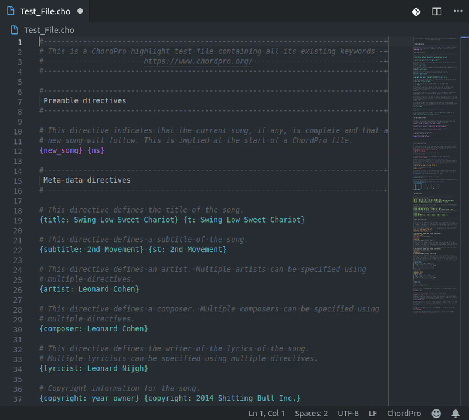

# Visual Studio Code ChordPro Extension

This extension provides ChordPro files support for VS Code.

> [ChordPro](https://www.chordpro.org/) (also known as Chord) is an ASCII
> text file format for transcribing songs with chords and lyrics.  
> Although this format is legible as it is, there are many popular programs for
> displaying, transposing and printing.  
> Files in this format often have extensions such as `.crd`, `.chopro`, `.pro`,
> `.chordpro` or `.cho`. [[wiki](https://en.wikipedia.org/wiki/ChordPro)]

## Features

- [x] Full syntax highlighting
- [ ] Full syntax snippets
- [ ] Rendering preview window
- [ ] Export to PDF songbook

## Requirements

None in this version.

## Extension Settings

None in this version.

## Known Issues

None.

## Release Notes

This is the first release of VS Code ChordPro extension.  
With it comes syntax highlighting support for one of the best song lyrics and
chords format.

Future releases will have, at some point in time, improvements in the
highlighting (add coloring by groups), and what's listed on the check list, in
the [Features](#Features) section.

To check the latest changes, read the [CHANGELOG.md](CHANGELOG.md).

## Contributing

All contributions are more than welcome! If you want to get started with a PR,
please do the following:  
_(3rd, 4th and 5th step are not required yet)_

1. Check out the [VS Code Extension Docs](https://code.visualstudio.com/docs/extensions/overview), especially [Running and Debugging Extensions](https://code.visualstudio.com/docs/extensions/debugging-extensions).
1. Fork this repo.
1. ~~Install dependencies with `npm install`. You'll also need to install dependencies in the `client` and `server` directories.~~
1. ~~Run `npm run watch` in a shell to get the Typescript compiler running.~~
1. ~~Run `npm run watch:client` to compile the client and `npm run watch:server` to compile the server. You'll need all three running to do development on the extension.~~
1. Open the repo directory in VS Code.
1. Make a code change and test it. You can use the Debug tab and the `Launch Extension` configuration to help.
1. Create a branch and submit a PR!

## License

This extension is licensed under the [MIT License](LICENSE.txt).
